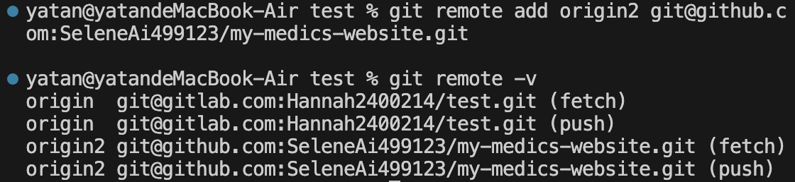

#  將本地存儲庫關聯至多個遠端存儲庫

## 建立關聯

使用`git remote add`指令，將本地存儲庫與多個遠端存儲庫做關聯。

```bash
git remote add origin <remote1_url>
git remote add origin2 <remote2_url>
```

!!!Note "Note"
    要透過 SSH URL 來存取遠端儲存庫，需要先建立用於通信的SSH金鑰對，詳細步驟可參考[這篇文章](./ssh-key.md)。

確認遠端儲存庫是否已經成功添加。
```bash
git remote -v
```




    