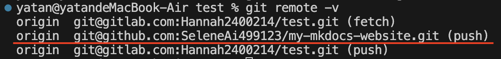
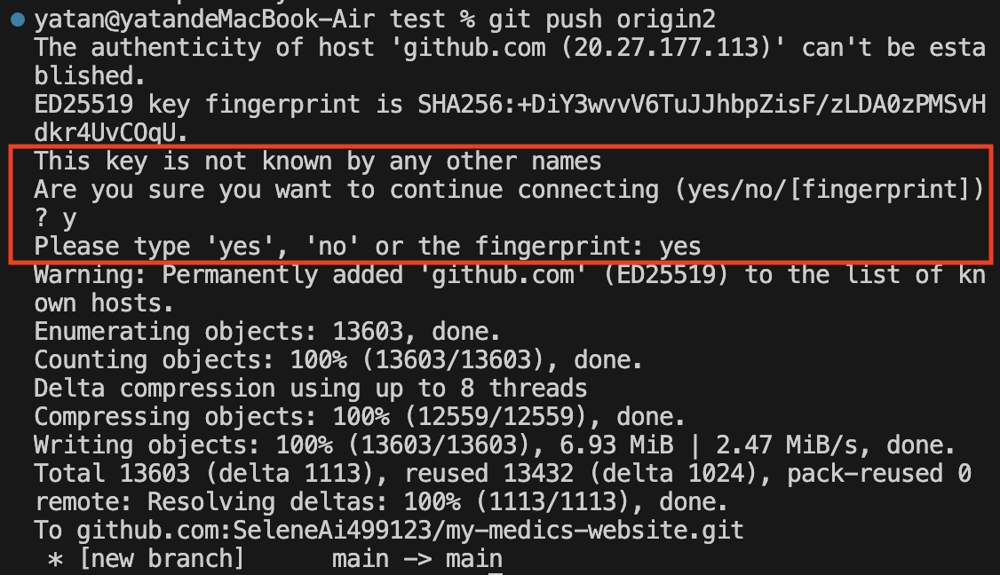
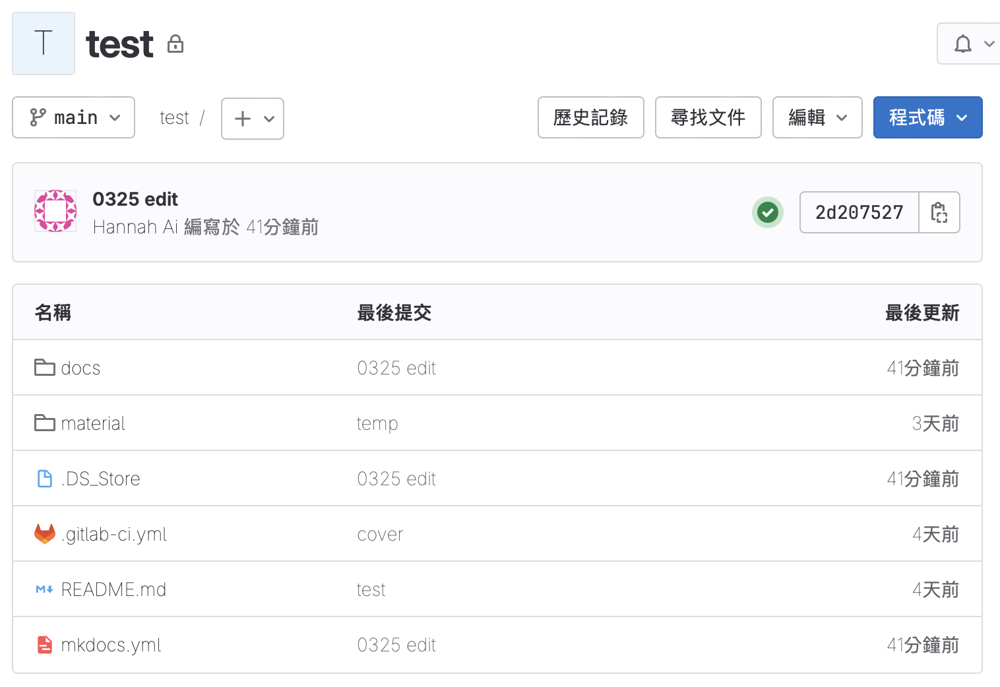
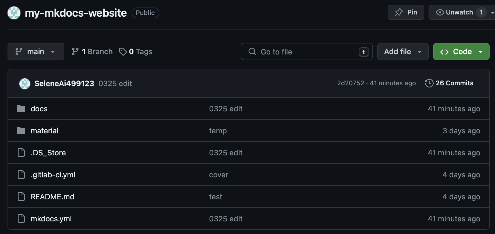

# 將本地變更推送至多個遠端存儲庫

本文章將說明，在已經連接一個遠端存儲庫的情況下，要怎麼透過`git push`指令，將本地的變更推送至多個遠端存儲庫。

---

## 建立關聯

1. 使用`git remote add`指令，新增一個主要的遠端儲存庫：

    ```bash
    git remote add  origin <remote_repository_URL_1>
    ```

2. 新增其他想要同步更新的遠端儲存庫 URL，使用`git remote set-url`指令並在後面加上`--add --push`：

    ```bash
    git remote set-url --add --push origin <remote_repository_URL_2>
    ```

3. 確認遠端儲存庫是否已經成功添加：

    ```bash
    git remote -v
    ```

    

---

## 提交變更(commit) 並 push

此時兩個遠端儲存庫共用 `origin` 別名，因此只要 push 一次，就能同步更新兩個遠端儲存庫拉！

```bash
# 提交變更(commit)
git add .
git commit -m "description"
 
# push 到遠端儲存庫
git push origin main
```

!!!warning "Warning"
    如果是第一次透過SSH URL進行通信時，會跳出提示訊息 Are you sure you want to continue connecting，這是因為該SSH URL 不存在於 SSH 代理的 known_hosts 名單內，這時輸入 `yes` 來確定進行連線。



---

## 執行結果

- push 到 GitLab 的結果



- push 到 GitHub 的結果




    