# 使用 Git 指令進行版本控制

## 常用控制指令

- [git init](#git-init) : 在目錄中初始化一個新的 Git 儲存庫。
- [git clone](#git-clone) : 從遠端儲存庫複製到本地。
- [git remote](#git-remote) : 管理遠端儲存庫。
- [git add / git stash](#git-add--git-stash) : 將文件的更改添加到暫存區。
- [git commit -m](#git-commit--m) : 將暫存區中的更改提交到儲存庫。
- [git reset / git revert](#git-reset--git-revert) : 撤銷更改。
- [git push](#git-push) : 將本地儲存庫中的提交推送到遠端儲存庫。

---


- ### **git init**

在當前目錄創建一個新的 Git 儲存庫，在後面加上檔案路徑可以指定儲存庫(local repo)位置。

```bash
git init <file directory>
```

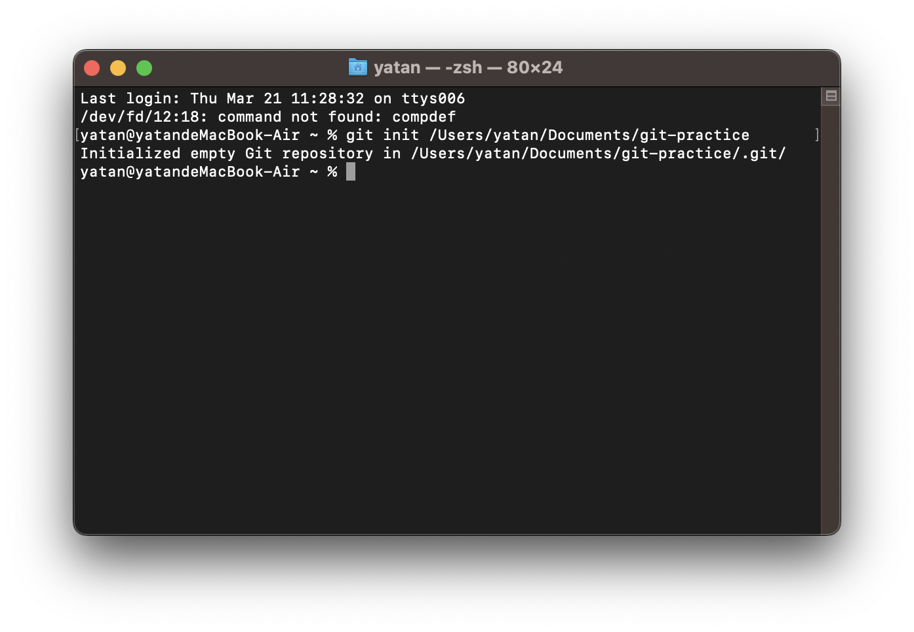

---

- ### **git clone**

或是將遠端倉庫(remote repo)複製到本機的工作目錄(working dir)下。

=== "HTTPS"
    ```bash
    git clone <https url>
    ```

=== "SSH"
    ```bash
    git clone <ssh url>
    ```

!!!info "Info"
    使用 SSH URL 與本機建立連結時，進行 git 操作需要透過 [ssh key pair](../git/ssh-key.md) 來進行通信授權。

---

- ### **git remote**

將本地儲存庫(local repo)與遠端儲存庫(remote repo)做關聯，`origin`是遠端儲存庫的別名，可自行定義。

```bash
git remote [add] origin <remote repository url>
```

| 參數       | 說明                        |
| --------- | --------------------------- |
| `remove`  | 刪除指定的遠端儲存庫           |
| `rename`  | 將遠端儲存庫的別名更改為新的名稱 |
| `set-url` | 設置遠端儲存庫的 URL          |
| `-v`      | 列出所有遠端儲存庫及其 URL     |


> 延伸閱讀：[將本地存儲庫關聯至多個遠端存儲庫](../git/git-remote-multi-repo.md)

---

- ### **git add / git stash**

提交檔案變更到暫存區(staging area)。

```bash
git add/stash <file name>     // 指定的檔案變更
git add/stash .               // 當前目錄下所有的變更
```

:bulb: ==git add 與 git stash的差異==：

1. **git add**  
    `git add` 命令用於將當前工作目錄中的指定文件的修改添加到暫存區（^^即將修改標記為準備提交的狀態^^）。
2. **git stash**  
    `git stash` 命令用於將當前工作目錄中的修改（包括已經跟蹤的和未跟蹤的文件）暫存起來，能夠在 ^^切換分支或處理其他任務時暫時保存修改^^， 通常會搭配使用`git stash pop`將最近一次暫存的更改應用到當前分支。

!!!success "總結"
    總的來說，`git stash` 用於將當前所有修改暫存起來，以便稍後恢復它們，而 `git add` 則用於將特定文件的修改添加到暫存區中，以準備提交到儲存庫。
    

---

- ### **git commit -m**

將暫存區內的檔案更改提交到儲存庫。

```bash
git commit -m "提交訊息"

```


---

- ### **git reset / git revert**

**1. git reset**
`git reset` 用於取消暫存區或已提交的變更，可以選擇性地修改暫存區和工作目錄的內容，^^可能會刪除或修改到歷史紀錄^^；

```bash
# 將檔案變更加入暫存區
git add .

# 取消暫存
git reset
```

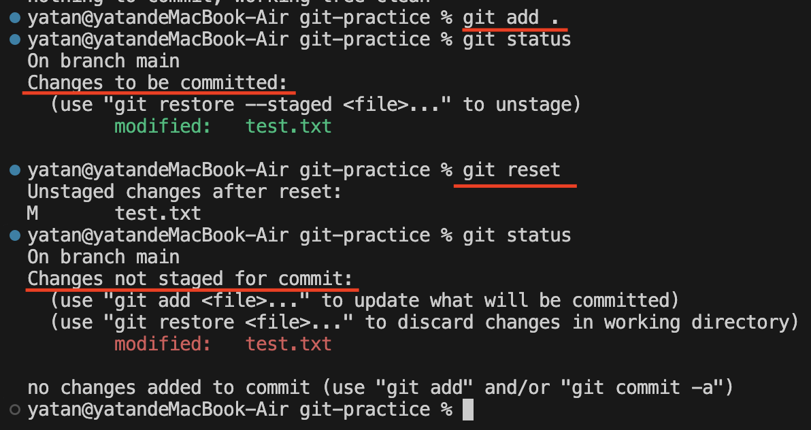

**2. git revert**

`git revert` 用於撤銷已提交的變更，同時創建一個新的commit來反映這些更改的撤銷，^^用於在保持歷史完整性的同時撤銷先前的更改^^。


```bash
git revert <commit> // 取消指定的commit
git revert HEAD     // 取消前一次的commit
```

輸入`git log`查看歷史紀錄：

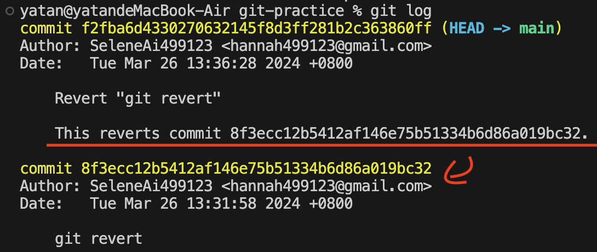

---

- ### **git push**

將本地已提交的變更推送到遠端儲存庫，遠端儲存庫別名`origin`，本地預設分支為`main`。

```bash
git push origin main
```


遠端儲存庫：


!!! warning "Git 在推送時要求輸入使用者名稱和密碼"
    通常是因為本地與遠端的關聯使用了 HTTPS URL，這意味著 Git 嘗試透過 HTTPS 協定進行認證。

!!! tip "解決辦法"
    將遠端倉庫的 URL 更改為 SSH URL，Git 將使用 SSH URL 進行遠端操作，而不再需要輸入使用者名稱和密碼。
    ```bash
    git remote set-url origin <SSH URL>
    ```
---

## 進階指令

- [git branch](#git-branch) : 建立新的分支
- [git checkout](#git-checkout) : 切換到不同分支。
- [git merge](#git-merge) : 將不同的分支合併在一起。
- [git pull / git fetch](#git-pull--git-fetch) : 從遠端儲存庫拉取更改。


---

- ### **git branch**

創建一個新的分支，名稱是 branch2，若在後面加上 `-d` 參數，則表示刪除分支。

=== "create"
    ```bash
    git branch branch2
    ```
=== "delete"
    ```bash
    git branch -d branch2
    ```


---

- ### **git checkout**

切換到不同的分支，加上 `-b` 參數，可以同時創建與切換分支，省略 `git branch` 的動作。

```bash
git checkout [-b] branch2
```
  
輸入`git branch`可以查看分支狀態：

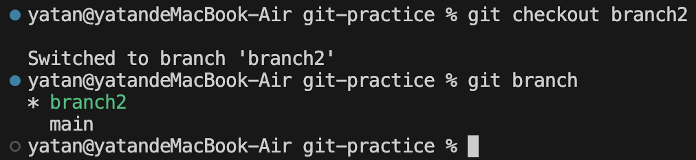


---

- ### **git merge**

使用`git merge`時會有幾種不同的情況，下面以 branch2 來示範：

1.  **分支的變更尚未被提交(commit)**

    如果 branch2 變更尚未被提交，可以將這些變更合併到 main 分支。  

    首先輸入 `git status` 查看工作目錄狀態，可以看到branch2有兩個未提交的檔案變更：

    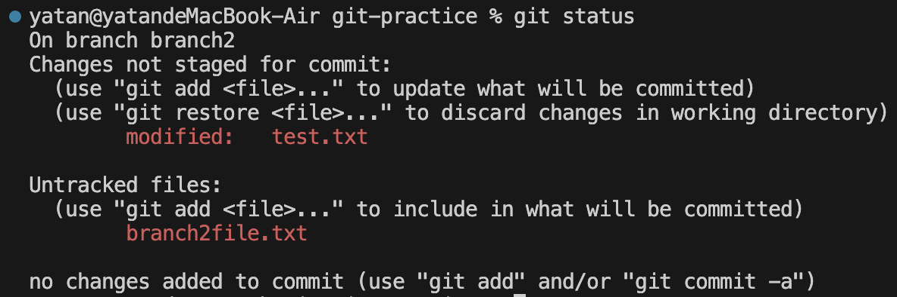

    接著添加branch2的所有變更到暫存區，然後將branch2的變更合併到 main 分支：

    ```bash
    # 添加branch2的所有變更到暫存區
    git add .

    # 將branch2的變更合併到 main 分支
    git checkout main
    git merge branch2
    ```
    
    !!!warning "注意"
        此時輸入 `git checkout branch2` 切回 branch2 ，會發現branch2內的檔案不會有任何變更，因為上面的示範是將 ==暫存區內的變更== commit 在 main 主要分支上。 
        === "branch2"
            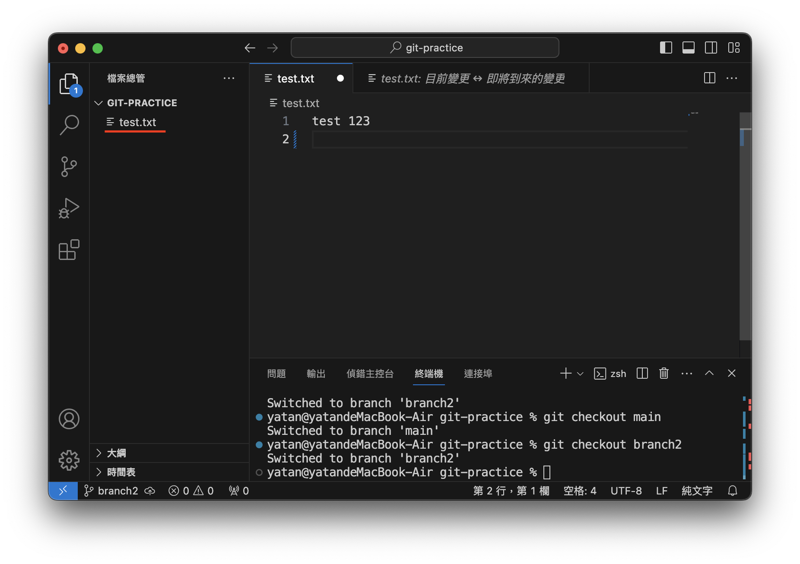
            
        === "main"
            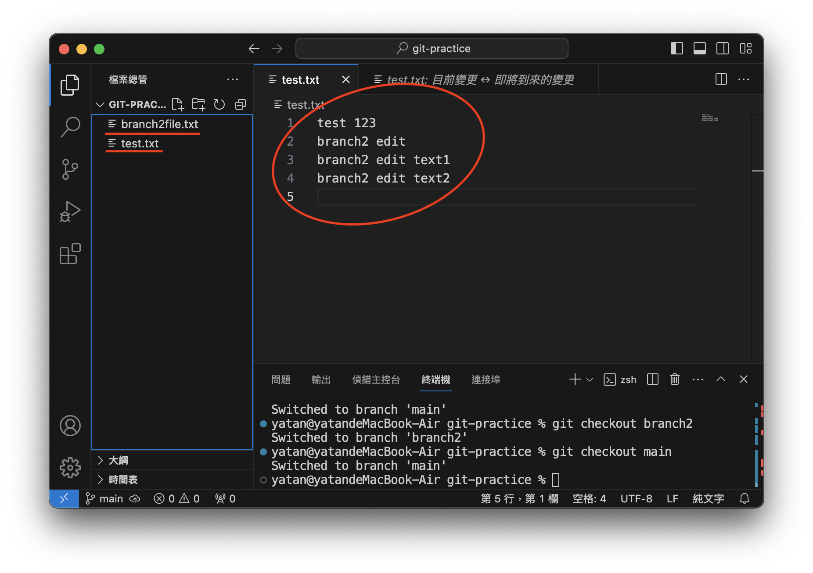

        


    

2.  **分支的變更已被提交**

    將 branch2 已提交的檔案合併到當前所在的分支(main)，合併操作可能會引發合併衝突(conflict)，這時需要手動解決這些衝突。

    ```bash
    # 提交分支的更改
    git add .
    git commit -m "branch2 commit" .

    # 將其他分支的變更合併到 main 分支
    git checkout main
    git merge branch2
    ```

    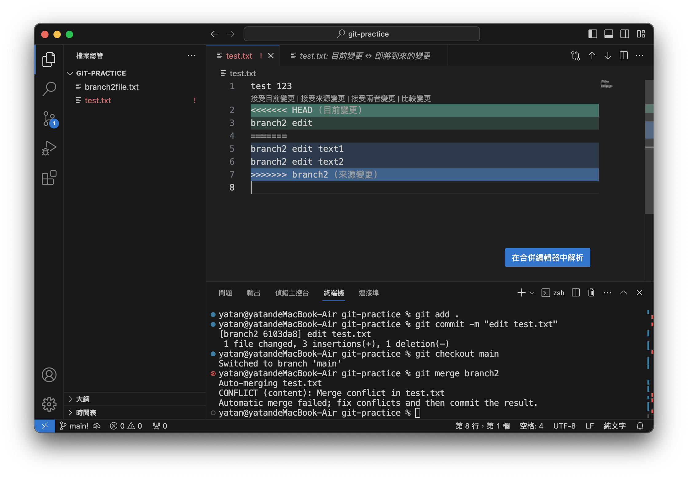

    !!!info "VS Code 發生檔案衝突時的顏色含義"
        - 綠色：本地的更改。
        - 紅色：其他分支或來源的更改。
        - 藍色：正在合併的兩個不同分支或來源的共同祖先版本。

3.  **合併遠端檔案**

    以下示範將遠端與本地的 `branch2` 分支合併：

    ```bash
    git checkout branch2
    git merge origin/main
    ```

    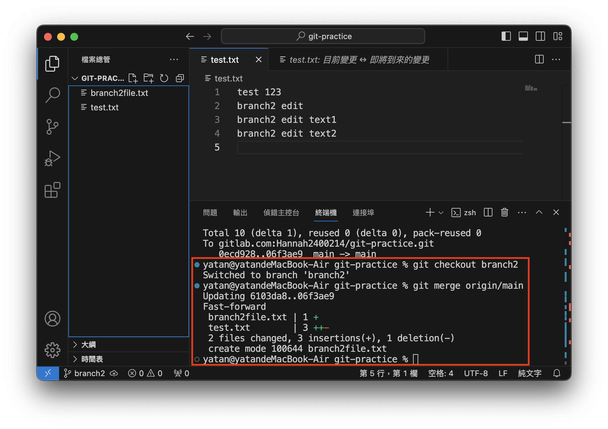

    !!!note "Note"
        `git merge` ==不會拉取遠端儲存庫暫存區的檔案變更，只會針對已提交的檔案進行合併== ，想要確保取得遠端儲存庫的最新版本，可以使用 [git pull](#git-pull) 指令。


---

- ### **git pull / git fetch**

`git pull` 命令實際上是兩個操作的組合，首先它會自動執行 `git fetch` 來從遠端儲存庫獲取最新的更改，然後再執行 `git merge` 將這些更改合併到本地分支中，以下是實際操作範例：

1. 手動在遠端新增一個`remote new file.txt`檔案。

    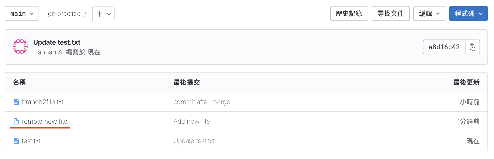

2. 手動修改`test.txt`檔案內容。

    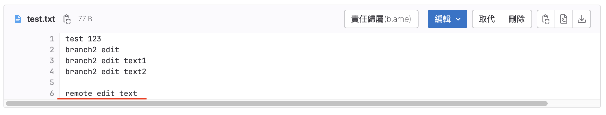

3. 將遠端儲存庫的所有變更以及檔案pull至本地並合併變更。

    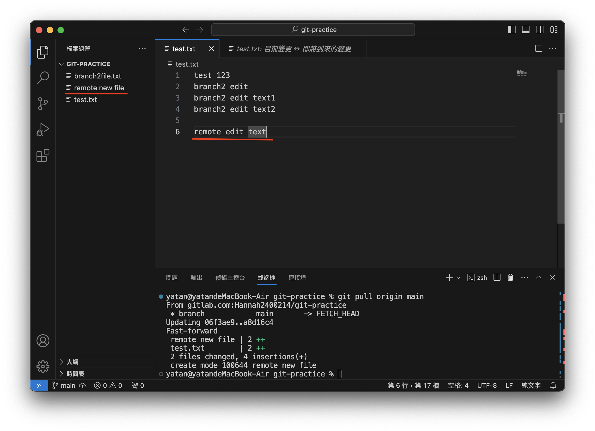

:bulb: ==git fetch / git merge /git pull 的差異==：

| 指令        | (Remote)暫存區變更   | (Remote)已提交檔案   | (Local)合併         |
| ----------  | :----------------: | :----------------: | :----------------: |
| `git fetch` | :white_check_mark: |                    |                    |
| `git merge` |                    | :white_check_mark: | :white_check_mark: |
| `git pull`  | :white_check_mark: | :white_check_mark: | :white_check_mark: |


---


## 查看狀態的指令

- `git status`：顯示工作目錄和暫存區中的檔案狀態，例如修改、暫存或未跟蹤的檔案。

- `git log`：顯示提交歷史，包括每個提交的作者、日期、提交訊息等。

- `git show`：顯示單個提交的詳細信息，包括檔案更改的內容。

- `git diff`：顯示工作目錄中的檔案與暫存區或上一個提交之間的差異。


