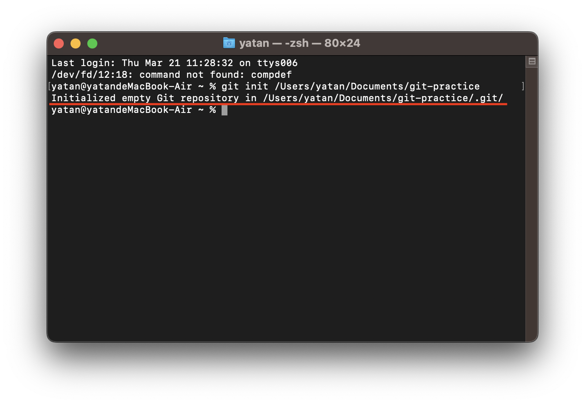

# Git 版本控制指令

## 控制指令

- [git init](#git-init) : 在目錄中初始化一個新的 Git 儲存庫。
- [git clone](#git-clone) : 從遠端儲存庫複製一個現有的儲存庫。
- [git remote](#git-remote) : 管理遠端儲存庫。
- [git add](#git-add) : 將文件的更改添加到暫存區。
- [git commit](#git-commit) : 將暫存區中的更改提交到本地儲存庫。
- [git push](#git-push) : 將本地儲存庫中的提交推送到遠端儲存庫。
- [git branch](#git-branch) : 建立新的分支
- [git checkout](#git-checkout) : 切換到不同分支。
- [git merge](#git-merge) : 將不同的分支合併在一起。
- [git pull](#git-pull) : 從遠端儲存庫拉取更改並合併到本地儲存庫。


- [git revert] : 撤銷提交。
- [git reset] : 撤銷更改，可以是暫存區的更改或提交的更改。


---


- ### **git init**

在本地目錄(local repo)創建一個新的 Git 儲存庫。

```bash
git init <file directory>
```



---

- ### **git clone**

或是將遠端倉庫(remote repo)複製到本機的工作目錄(working dir)下。

=== "HTTPS"
    ```bash
    git clone <https url>
    ```

=== "SSH"
    ```bash
    git clone <ssh url>
    ```

!!!info "Info"
    使用 SSH URL 與本機建立連結時，需要透過 [ssh key pair](../git/ssh-key.md) 來進行通信授權。

---

- ### **git remote**

將本地儲存庫(local repo)與遠端儲存庫(remote repo)做關聯，`origin`是遠端儲存庫的別名。

```bash
git remote add origin <remote repository url>
```

> 延伸閱讀：[將本地存儲庫關聯至多個遠端存儲庫](../git/git-remote-multi-repo.md)

---

- ### **git add**

提交檔案變更到暫存區(staging area)。

```bash
git add <file name>     // 指定檔案
git add .               // 當前目錄下所有已變更的檔案
```

---

- ### **git commit**

將暫存的更改提交到儲存庫。

```bash
git commit -m "提交訊息"

```


---

- ### **git push**

將本地變更推送到遠端儲存庫，本地分支名稱預設是`main`。

```bash
git push origin <分支名>
```


遠端儲存庫：


!!! warning "Git 在推送時要求輸入使用者名稱和密碼"
    通常是因為本地與遠端的關聯使用了 HTTPS URL，這意味著 Git 嘗試透過 HTTPS 協定進行認證。

!!! tip "解決辦法"
    將遠端倉庫的 URL 更改為 SSH URL，Git 將使用 SSH URL 進行遠端操作，而不再需要輸入使用者名稱和密碼。
    ```bash
    git remote set-url origin <SSH URL>
    ```


---

- ### **git branch**

創建一個新的分支，名稱是 branch2。

```bash
git branch branch2
```

---

- ### **git checkout**

切換到不同的分支，使用`git branch`查看。

```bash
git checkout branch2
```


---

- ### **git merge**

使用`git merge`時會有幾種情況，下面以 branch2 來示範：

1.  **分支的變更尚未被提交**

    如果 branch2 變更尚未被提交，可以將這些變更合併到 main 分支。  

    用 `git status` 查看工作目錄狀態：

    

    添加branch2的所有變更到暫存區，然後將branch2的變更合併到 main 分支：

    ```bash
    # 添加branch2的所有變更到暫存區
    git add .

    # 將branch2的變更合併到 main 分支
    git checkout main
    git merge other_branch
    ```
    
    !!!warning "Warning"
        此時輸入 `git checkout branch2` 切回 branch2 ，會發現檔案不會有任何變更，因為上面的示範是將 ==檔案變更== 的這個動作 commit 在 main 主要分支上。
    
    === "main"
        

    === "branch2"
        


    

2.  **分支的變更已被提交(commit)**

    將 branch2 的檔案合併到當前所在的分支(main)，合併操作可能會引發合併衝突，這時需要手動解決這些衝突，然後將修改的檔案添加到暫存區，並提交合併的結果。

    ```bash
    # 提交分支的更改
    git add .
    git commit -m "branch2 commit" .

    # 將其他分支的變更合併到 main 分支
    git checkout main
    git merge branch2

    # 添加修改後的檔案到暫存區
    git add test.txt
    # 提交合併的結果
    git commit -m "Resolved merge conflict"
    ```

    

3.  **合併遠端檔案**

    以下示範將遠端的 `main` 分支與本地的 `branch2` 分支合併：

    ```bash
    git checkout branch2
    git merge origin/main
    ```

    

    !!!warning "Warning"
        `git merge` 不會拉取遠端儲存庫的 ==更改動作== ，只會針對 ==已提交變更== 的遠端儲存庫檔案進行合併，想要確保取得遠端儲存庫的最新版本，可以使用 [git pull](#git-pull) 指令。


---

- ### **git pull**

git pull 命令實際上是兩個操作的組合：首先它會自動執行 git fetch 來從遠端儲存庫獲取最新的更改，然後再執行 git merge 將這些更改合併到本地分支中。

手動在遠端新增一個`remote new file.txt`檔案，並修改`test.txt`檔案內容。


將遠端儲存庫的所有變更pull至本地並合併變更。


## 狀態指令

- `git status` : 顯示目前工作目錄的狀態，包括已修改的文件和暫存區的狀態。
- `git log` : 顯示提交歷史記錄。
- `git branch` : 顯示或管理分支。
- `git remote -v` : 列出遠程儲存庫的詳細信息。


