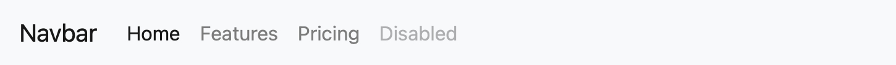
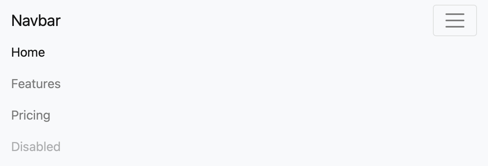

# 導覽列樣式

## 引入 Bootstrap

[Bootstrap](https://getbootstrap.com) 是受歡迎的前端框架，用於建立響應式、行動優先的網站，讓網站排版可以自動適應螢幕大小。要套用 [Bootstrap](https://getbootstrap.com) 需要在`index.html`文件的`<head>`裡面添加：

=== "link"

    ``` html
    <link href="https://cdn.jsdelivr.net/npm/bootstrap@5.3.3/dist/css/bootstrap.min.css" rel="stylesheet" integrity="sha384-QWTKZyjpPEjISv5WaRU9OFeRpok6YctnYmDr5pNlyT2bRjXh0JMhjY6hW+ALEwIH" crossorigin="anonymous">
    ```

=== "script"

    ``` html
    <script src="https://cdn.jsdelivr.net/npm/bootstrap@5.3.3/dist/js/bootstrap.bundle.min.js" integrity="sha384-YvpcrYf0tY3lHB60NNkmXc5s9fDVZLESaAA55NDzOxhy9GkcIdslK1eN7N6jIeHz" crossorigin="anonymous"></script>
    ```


也可以輸入以下指令安裝在專案目錄內：
```bash
npm install bootstrap@5.3.3
```

---

## 選單 navbar
 
使用 Bootstrap 的響應式 [navbar](https://getbootstrap.com/docs/4.0/components/navbar/) 樣板，當使用者介面縮小時可在右方產生三明治按鈕。

!!! example
    === "縮小前"
        

    === "縮小後"
        


```html
<nav class="navbar navbar-expand-lg navbar-light bg-light">
  <a class="navbar-brand" href="#">Navbar</a>
  <button class="navbar-toggler" type="button" data-toggle="collapse" data-target="#navbarNav" aria-controls="navbarNav" aria-expanded="false" aria-label="Toggle navigation">
    <span class="navbar-toggler-icon"></span>
  </button>
  <div class="collapse navbar-collapse" id="navbarNav">
    <ul class="navbar-nav">
      <li class="nav-item active">
        <a class="nav-link" href="#">Home <span class="sr-only">(current)</span></a>
      </li>
      <li class="nav-item">
        <a class="nav-link" href="#">Features</a>
      </li>
      <li class="nav-item">
        <a class="nav-link" href="#">Pricing</a>
      </li>
      <li class="nav-item">
        <a class="nav-link disabled" href="#">Disabled</a>
      </li>
    </ul>
  </div>
</nav>
```

---

## 下拉選單 dropdown


```html
<li class="nav-item dropdown">
    <a class="nav-link dropdown-toggle" href="#" id="navbarDropdownMenuLink" data-toggle="dropdown" aria-haspopup="true" aria-expanded="false">
        Dropdown link
    </a>
    <div class="dropdown-menu" aria-labelledby="navbarDropdownMenuLink">
        <a class="dropdown-item" href="#">Action</a>
        <a class="dropdown-item" href="#">Another action</a>
        <a class="dropdown-item" href="#">Something else here</a>
    </div>
</li>
```

---


> 參考資料  
> [Bootstrap Navbar](https://getbootstrap.com/docs/4.0/components/navbar/)


